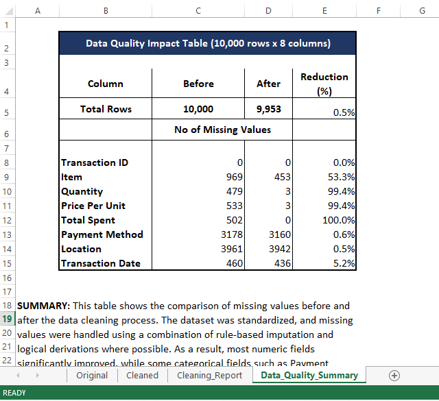
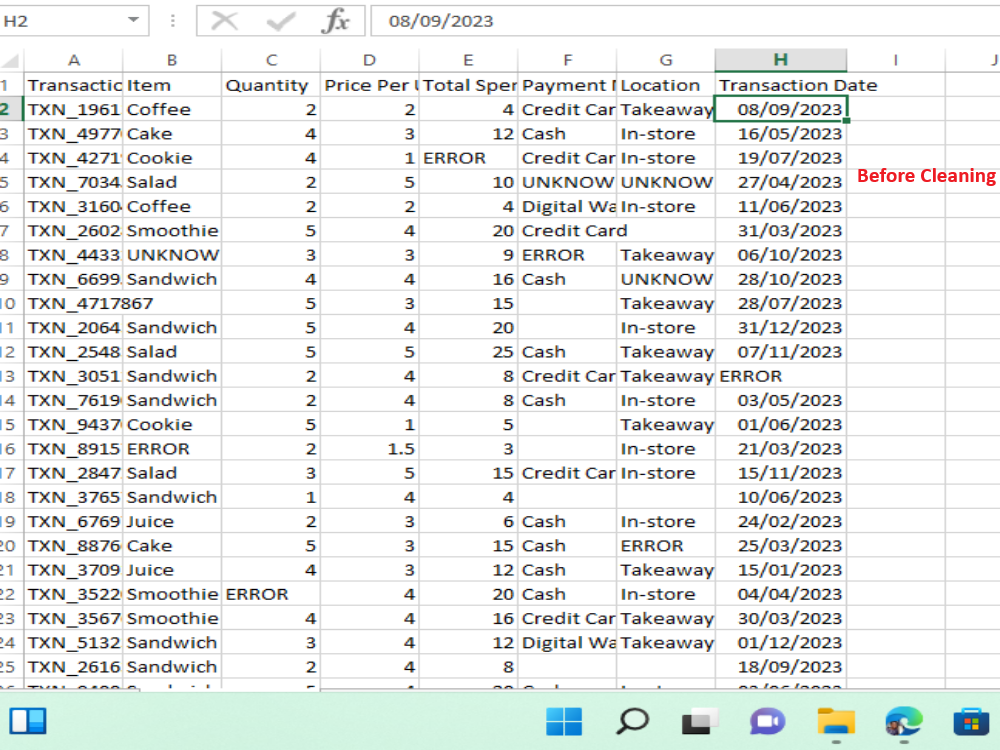
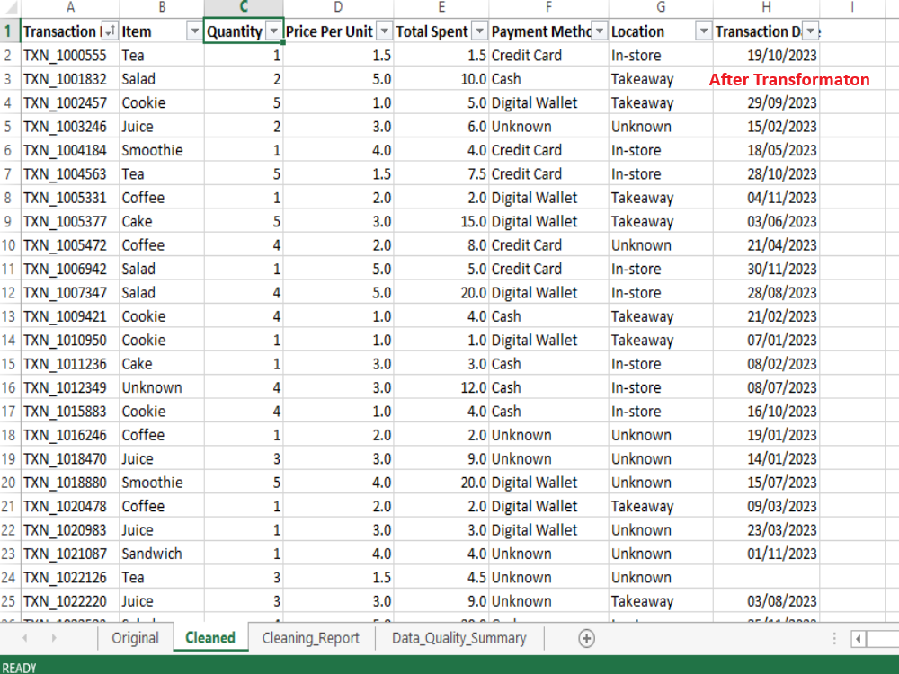

#  Retail Café Transaction Data Cleaning

📽️ Cleaning Process Video:  
[Watch the Cleaning Process](image/Excel_Data_Cleaning.mp4)
---

##  Project Overview

This project focuses on cleaning and standardizing a raw retail cafe transaction dataset containing **10,000 rows and 8 columns**.

This project simulates real-world retail transactional data cleaning for business analytics and reporting use cases.

The objective was to transform messy transactional data into a **clean, reliable, and analysis-ready dataset** suitable for business reporting, revenue analysis, and customer behaviour insights.

---

##  Objectives

- Identify and handle missing and inconsistent data
- Standardize categorical and numeric fields
- Recover missing values using deterministic business rules
- Ensure data integrity for downstream analytics
- Remove analytically unusable records only as a last resort

---

##  Dataset Structure

| Column | Description |
|---|---|
| `transaction_id` | Unique transaction identifier |
| `item` | Product purchased |
| `quantity` | Number of units |
| `price_per_unit` | Unit price of each item |
| `total_spent` | Total transaction value |
| `payment_method` | Payment type used |
| `location` | Store location |
| `transaction_date` | Date of transaction |

---

# 🧹 Data Cleaning Methodology

## 1. Data Profiling & Initial Assessment

### What was done:

* Verified dataset structure (10,000 rows × 8 columns)
* Checked uniqueness of `transaction_id`

**Finding:** No duplicate transaction IDs detected, confirming data integrity at the record level. This ensures each row represents a unique business transaction, preventing duplication bias in revenue analysis.

---

### 2. Standardization of Missing Values
 
Inconsistent missing value indicators were unified for consistency:
 
| Original Value | Standardized To |
|---|---|
| `'UNKNOWN'` | `"Unknown"` |
| `'ERROR'` | `"Unknown"` |
| Blank (text fields) | `"Unknown"` |
| Blank (numeric fields) | `NULL` |
 
This prevents incorrect grouping during aggregation and ensures numerical operations remain valid.

### 3. Data Type Correction
 
- Numeric fields converted to proper numeric types
- Date fields converted to datetime format
- Text fields trimmed and standardized for case consistency

Correct data types are essential for accurate aggregation (SUM, AVG), time-series analysis, and dashboard reliability.

---

### 4. Feature Recovery via Derived Calculations
 
Missing values were recovered using logical business relationships before any deletion was considered:
 
| Missing Field | Recovery Formula |
|---|---|
| `total_spent` | `quantity × price_per_unit` |
| `price_per_unit` | `total_spent ÷ quantity` |
| `quantity` | `total_spent ÷ price_per_unit` |
 
This minimized data loss and improved dataset completeness without introducing assumptions.

---

### 5. Rule-Based Item Imputation
 
A deterministic one-to-one mapping between `price_per_unit` and `item` was derived from observed dataset patterns.
This approach assumes price stability per product within the dataset scope.
 
**Example mappings applied:**
 
| No of Unknown Item Recovered | Items |
|---|---|
| 121 | Cookie |
| 118 | Tea |
| 126 | Coffee |
| 124 | Salad |
 
> ⚠️ Ambiguous mappings (where a price mapped to more than one item) were **not imputed** to preserve analytical integrity.

---

### 6. Transaction Ordering
 
The dataset was sorted by `transaction_id` in ascending order to ensure reproducibility, a structured audit trail, and easier validation.

---

### 7. Deletion Strategy
 
Rows were only removed when they held **no analytical value after all recovery attempts were exhausted**.
 
| Records Removed | Reason |
|---|---|
| 3 rows | Missing `item`, `price_per_unit`, and `total_spent` |
| 20 rows | Missing `quantity` and `total_spent` |
| 4 rows | Missing `item`, `payment_method`, and `transaction_date` |
| 7 rows | Missing `item`, `location`, and `transaction_date` |
| 13 rows | Missing `item` and `transaction_date` |
| **47 rows total** | |
 
These records lacked the minimum fields (product, time reference, transaction value) required for any meaningful revenue, product, or trend analysis.

---

### Data Quality Summary

---

## Final Output
 
The cleaned dataset is fully standardized, structurally consistent, and ready for dashboards, reporting, and downstream business analysis.
 
**Final dataset:** 9,953 rows x  8 columns
 - 47 rows removed
 - Zero duplicate transaction IDs

### Before & After
 
| Before Cleaning | After Cleaning |
|---|---|
|  | 

---

## Key Takeaways
 
- Data cleaning is not just removal, it involves **recovery, validation, and standardization**
- Deterministic rules are safer and more defensible than assumption-based imputation
- Missing values should be treated differently based on field type (text vs. numeric)
- Deletion should only occur after all recovery attempts have been exhausted

---

## Skills Demonstrated
 
- Data Cleaning & Preprocessing
- Missing Value Recovery (formula-based and rule-based)
- Deterministic Item Imputation
- Data Type Correction & Standardization
- Business Logic Application
- Data Validation & Integrity Checks

---

## Tools Used
 
- **Microsoft Excel** - data cleaning, transformation, and validation
- Excel functions
- Manual profiling and audit review

---

## Reproducibility

All cleaning steps were performed in Microsoft Excel using documented formulas and structured workflows. The process is fully reproducible using the same raw dataset and transformation steps outlined above.

---

## Conclusion
 
This project demonstrates a structured, reproducible approach to cleaning messy retail transactional data using deterministic logic, standardization techniques, and business-rule validation. The result is a dataset optimized for reliable reporting, dashboarding, and downstream business analysis.